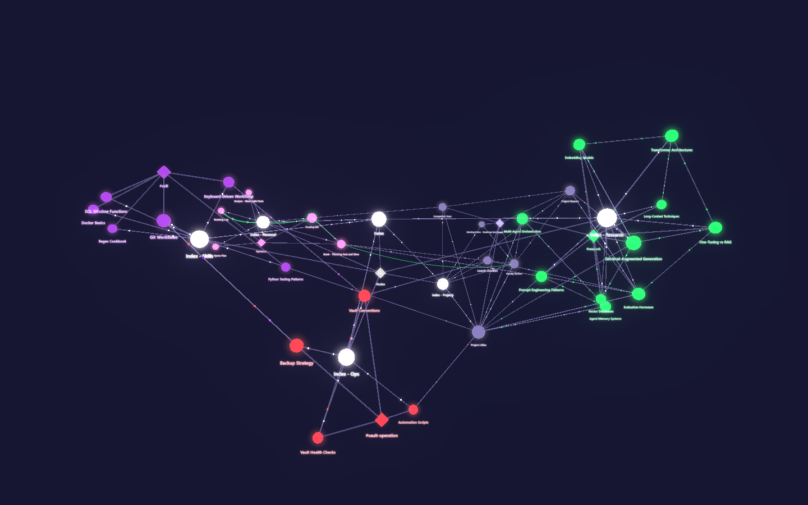
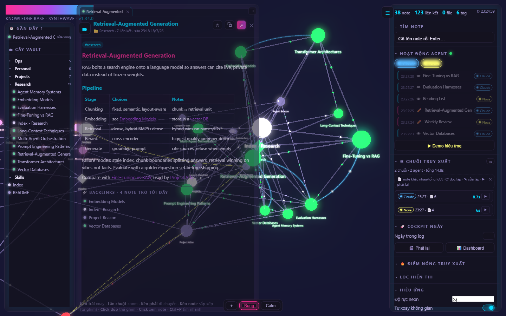
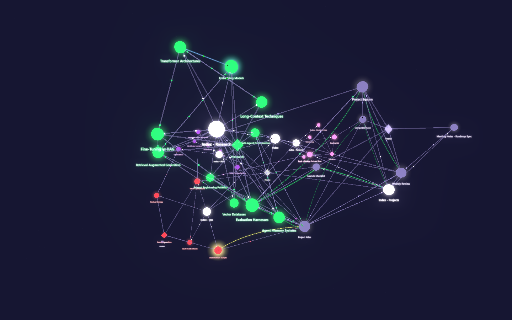
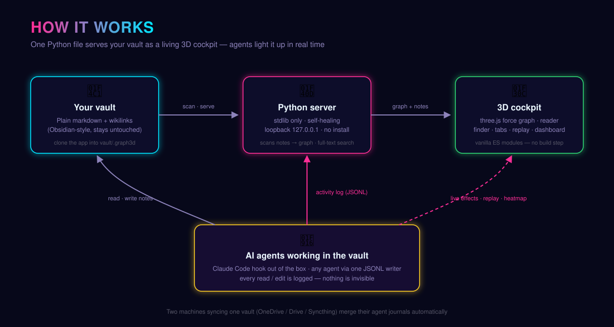
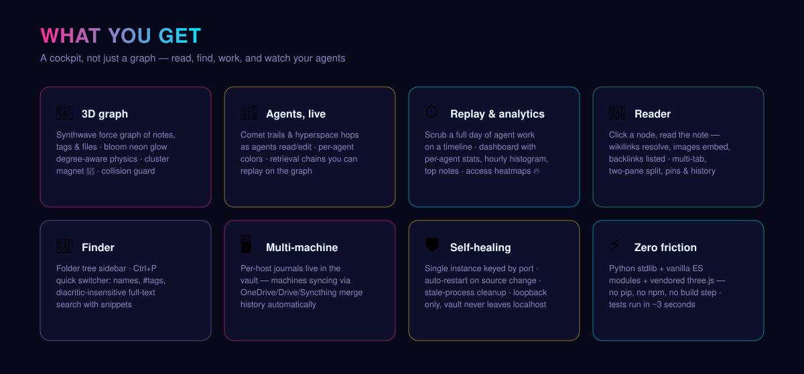

# Agents Knowledge Base

**A 3D cockpit for your markdown knowledge vault — and a live window into the AI agents working inside it.**

**🌐 Landing page: [chuong1224.github.io/agents-knowledge-base](https://chuong1224.github.io/agents-knowledge-base/)**

Point it at a folder of markdown notes (an Obsidian-style vault) and it serves a local web app: an interactive, synthwave-styled 3D force graph of every note, tag and attachment — with a built-in reader, full-text finder, tabbed workspace, and a layer no PKM tool has: **real-time visualization, replay and analytics of AI-agent activity** (Claude Code out of the box; any agent via a simple JSONL hook).

> Python stdlib server + vanilla ES modules + vendored three.js. **No pip install, no npm, no build step.**



<p align="center"><em>Two agents tearing through 120 notes at full speed — comet trails, hyperspace hops, impact ripples, live</em></p>


<p align="center"><em>The full cockpit: reader, finder tree, live agent feed and retrieval chains around the graph</em></p>



<p align="center"><em>The aftermath — Claude's blue and Nova's yellow trails woven across every continent</em></p>



*All screenshots come from the bundled synthetic [demo vault](demo/vault) — spin it up yourself.*

## How it works



## Features



### 🌌 The graph
- Force-directed 3D graph of notes, tags and attachments, colored by tag groups, with a bloom "neon" glow and adjustable intensity
- Degree-aware physics (hubs get room, leaves hug their hub), optional 🧲 cluster-magnet mode per color group, collision guard, smooth settling when filtering
- Layout presets — Expand, Calm, and 🪐 Universe (arranges notes by the index tree: root at the center, each index a hub, leaves on a Fibonacci sphere around it), deterministic across reloads
- Two deliberate filter semantics: color groups *spotlight* (dim but keep context), tag/extension filters *declutter* (remove entirely); your tag and color-group choices persist across sessions
- Accessibility: AA-contrast panel palette, keyboard-operable controls, respects `prefers-reduced-motion`

### 🤖 Agent activity, live on the graph
- A `PostToolUse` hook (Claude Code example below) logs every file operation an agent performs in the vault
- Events fire cinematic effects: comet chains along retrieval paths, three-phase "hyperspace jump" hops between notes, per-agent colors, dwell trails that linger like a starfield
- Retrieval chains are grouped and replayable; hot links glow in the agent's color
- ⏱ **Cockpit** — scrub through a full day of agent activity on a timeline (play/pause/speed), plus a dashboard: per-agent stats, hourly histogram, top notes
- 🔥 Heatmaps — recent-window and long-term cumulative access frequency; hot notes swell and glow

### 📖 Reading & finding
- Click a node → read the note in place (markdown-it): wikilinks resolve, image/video embeds, backlinks
- Folder-tree sidebar (drag to resize) + quick switcher `Ctrl+P`: file names, `#tags`, and diacritic-insensitive full-text search
- Workspace: multi-tab reading, ⧉ two-pane split, ☆ pinned notes, 🕘 reading history — all persisted across sessions

### 🩺 Vault health — retrieval and integrity
- **Retrieval health** (`/insight`): what your agents actually reach — hottest notes this week vs last, notes cooling off, notes nobody has touched in a while (with an age histogram that needs no threshold), notes never on any retrieval path, weakly connected clusters on the *note-to-note* graph, and coverage per area. Same function powers a CLI report generator (`python insight.py --report`)
- **Integrity lamps** (`/integrity`): what is actually *broken*. Four **structural** checks need no configuration — dangling `[[wikilinks]]`, broken `![[embeds]]`, `[[Note#Heading]]` anchors that no longer match, orphaned images/videos. Five **contract** checks read your own rules — required frontmatter fields, binary attachments never summarised in the note, tags outside your controlled vocabulary, index files carrying the wrong tags, and `title` that no longer matches the filename and the H1. Click any finding to open the note right where it is
- Both refresh on demand (no background polling). Integrity honours per-note opt-outs (`_`-prefixed filenames, `gate_ignore: true`)
- **Turning the contract checks on:** copy [`docs/vault-rules.example.json`](docs/vault-rules.example.json) to your vault root as `vault-rules.json` (or into `.graph3d/`, or point `GRAPH3D_VAULT_RULES` at its folder) and **edit it to your own vocabulary** — it is a template, not a drop-in. Each check reads only its own slice, so a file declaring just `mandatory_frontmatter` lights that one lamp and leaves the rest off; add keys as you go. No file at all: the five lamps switch off cleanly and the structural four still run
- Deliberate exceptions are declared, not guessed: `title_rule.exceptions` pins the allowed `title` (and `h1`) for a file whose name cannot match its heading. Being listed is not an exemption — drift past the pinned value is still reported, and an exception naming a note that no longer exists is reported too, so the list cannot rot
- `python integrity.py` prints the same report in a terminal and **exits 1 when something is broken**, so it drops straight into a pre-commit hook or CI step

### 🌱 Starts from nothing
- Point the app at a folder with **no notes at all** and it offers three ways in — the bundled demo vault (own port, your real server untouched), a **starter vault written into that folder on one click**, or a one-minute guide with a rescan button
- It also catches the most common first-run mistake: if the app folder isn't named `.graph3d`, it is reading the folder *above the clone* as your vault — the app says which folder that is, shows the right clone command, and offers a "this really is my vault" button if you know better
- Scaffolding the starter vault opens the first note for you, and the invitation stays one click away at the bottom of the screen until the vault has notes
- Writing files is deliberately narrow: it never overwrites an existing file, and it only scaffolds into a folder that has no notes yet
- The two endpoints that have side effects are the only non-GET routes in the app, and they check the request origin — everything else is read-only

### 🌳 Work map (optional)
- If your vault keeps a machine-readable map of open work, the app renders it as a **branching tree**: one band per area, columns by dependency depth (leaves on the left), arrows meaning *must be done first*
- Click any item to open the note where that work was declared; the "ready only" filter shows just what is actionable **on the machine you are sitting at**
- The server imports the map's own script and caches by mtime — classification rules live in the vault, never duplicated in the app. Point `GRAPH3D_WORKMAP_DIR` at your work-map folder (it must expose `work.py` with `load()`/`export_data()` plus `work.json`). No map → the endpoint returns 404 and the panel says so

### 🖥 Multi-machine, self-healing
- Per-host activity journals live inside the vault → two machines syncing the same vault (OneDrive, Drive, Syncthing…) merge their histories automatically; no server needed on the second machine
- Single-instance server keyed by port: verifies health by boot id, auto-restarts when source changes, cleans up stale processes — and refuses to kill anything it cannot verify as its own
- Loopback only (`127.0.0.1`) — your vault is never exposed to the network

## Quickstart

Requirements: **Python 3.9+** and a modern browser. Primary platform is **Windows** (process management shells out to PowerShell); the server itself is cross-platform and mac/linux support is on the roadmap.

### 🚀 Try it in 60 seconds — no vault needed

```bash
git clone https://github.com/chuong1224/agents-knowledge-base
cd agents-knowledge-base
python try_demo.py
```

That runs the cockpit on the **bundled 120-note demo vault** — the same one every screenshot and GIF above comes from. Fly around, click nodes to read them, press `Ctrl+P` to search, hit **▶ Demo hiệu ứng** to see the agent effects.

### 📁 Install into your own vault

```bash
# clone INTO your vault as a dot-folder (keeps it invisible to your note tools)
# ⚠ replace "path/to/YourVault" with the real path to YOUR vault — the folder
#   that holds your markdown notes, e.g. "D:/Notes" or ~/Documents/Vault
git clone https://github.com/chuong1224/agents-knowledge-base "path/to/YourVault/.graph3d"
cd "path/to/YourVault/.graph3d"
python ensure_graph3d.py
```

That's it — the app opens at `http://127.0.0.1:8321`. The vault root is simply the parent folder of `.graph3d/`. Re-running `ensure_graph3d.py` is idempotent (reuses a healthy server, replaces a stale one). On Windows you can also double-click `Start-Graph3D.bat`.

### 🌱 No vault yet? Start from zero

Here's the secret: **a vault is just a folder of markdown files.** You don't need Obsidian or any special app to start one — any text editor works, and an AI agent can do the writing for you. ([Obsidian](https://obsidian.md) is a great *editor* to adopt later; it opens the exact same folder.)

This repo ships a [`starter-vault/`](starter-vault/) — 9 short notes that teach notes, `[[wikilinks]]`, tags, and hub notes *by being read inside the app itself* (Vietnamese summary included).

**The app offers all of this to you, in the UI.** Open it on a folder with no notes and instead of an empty void you get three doors:

- **🌌 See the demo vault** — starts a second server on port **8322** for the bundled 120-note vault; the one on your own vault is left running, untouched
- **🌱 Create your first vault right here** — copies `starter-vault/` into the folder you opened, reloads the graph in place, and never overwrites a file that already exists
- **📖 Do it yourself — 1 minute** — three steps and a **rescan** button

Same two actions from a terminal, if you prefer:

```bash
python ensure_graph3d.py --demo                    # demo vault, own port, nothing installed
python ensure_graph3d.py --init-starter "path/to/MyVault"
```

Or lay it out by hand:

```bash
# copy the starter vault anywhere you like, then install the app into it
cp -r starter-vault "path/to/MyVault"
git clone https://github.com/chuong1224/agents-knowledge-base "path/to/MyVault/.graph3d"
cd "path/to/MyVault/.graph3d"
python ensure_graph3d.py
```

Open **Start Here** in the Reader and follow along — in ten minutes you'll have edited your first note and watched the graph react.

## Hook up an agent

**Claude Code** — add to your vault's `.claude/settings.json`:

```json
{
  "hooks": {
    "PostToolUse": [
      {
        "matcher": "Read|Grep|Glob|Edit|Write|MultiEdit|NotebookEdit",
        "hooks": [
          {
            "type": "command",
            "command": "python \"$CLAUDE_PROJECT_DIR/.graph3d/log_activity.py\"",
            "shell": "bash",
            "async": true,
            "timeout": 15
          }
        ]
      }
    ]
  }
}
```

**Any other agent or script**: pipe the same hook-style JSON payload into `log_activity.py` and label the stream with `--agent "MyAgent"` — each agent gets a stable color on the graph. See the module docstring for the payload shape.

Remove the hook and the app still works fully — you just lose the live layer.

## Configuration

| What | Where |
|---|---|
| Tag → color groups | `TAG_COLORS` in `build_graph_data.py` (order = priority) + `GROUP_ORDER` in `src/state.js` |
| Folders excluded from the graph | `EXCLUDED_DIRS` in `build_graph_data.py` |
| Port | `python ensure_graph3d.py --port 9000` |
| Physics feel | constants in `physics()` in `src/graph.js` |
| Default neon intensity | `S.neon` in `src/state.js` |

The default tag taxonomy reflects the author's vault — moving it to a config file is the top roadmap item.

> **Note on language:** the UI is currently in Vietnamese (the author's working language). English i18n is on the roadmap.

## Tests

```bash
python tests/selfcheck.py        # ~3s: compile checks + behavior contracts + unit tests
python tests/selfcheck.py --slow # adds port/kill-policy integration tests (~16s)
```

The suite is designed to run with the app installed inside a real vault.

## Roadmap

- Config file for tag groups & colors (no code edits needed)
- Standalone mode (`--vault path`) without installing into the vault
- English UI / i18n
- Cross-platform process management (mac/linux)
- Semantic search for vaults that outgrow full-text

## Origin

This is the daily driver for the author's own agent-operated knowledge base: AI agents read and write the vault all day, and this cockpit is how that work is watched, replayed and measured. It has grown through 30+ versioned iterations — graph first, then reader, finder, cockpit and workspace — pair-programmed with Claude, with a contract-encoded test suite guarding against every regression that ever actually happened.

## License

[MIT](LICENSE)

---

# 🇻🇳 Tiếng Việt

**Buồng lái 3D cho vault ghi chú markdown — và cửa sổ realtime nhìn các AI agent đang làm việc bên trong.** (Toàn bộ ảnh chụp phía trên lấy từ [demo vault](demo/vault) tổng hợp kèm repo — không phải dữ liệu thật.)

Trỏ vào một thư mục note markdown (vault kiểu Obsidian), app phục vụ giao diện web local: graph 3D synthwave toàn bộ note/tag/file, kèm panel đọc note, tìm kiếm full-text, workspace đa tab — và lớp đặc sản: **hiển thị realtime + replay + thống kê hoạt động AI agent** (Claude Code dùng ngay; agent khác qua hook JSONL đơn giản).

- **Chạy thử 60 giây (không cần vault):** clone repo → `python try_demo.py` → mở ngay demo vault 120 note (nguồn của mọi ảnh/GIF phía trên).
- **Cài đặt vào vault của bạn:** chỉ cần Python 3.9+ — clone vào vault thành thư mục `.graph3d` (trong lệnh mẫu, thay `YourVault` bằng **đường dẫn thư mục vault của bạn** — thư mục chứa các note markdown, ví dụ `D:/Notes`), chạy `python ensure_graph3d.py`, app mở tại `http://127.0.0.1:8321`. Không pip, không npm, không build. Windows có thể double-click `Start-Graph3D.bat`.
- **Chưa có vault? KHÔNG cần Obsidian trước.** Vault chỉ là một thư mục chứa file `.md` — soạn bằng Notepad cũng được. Obsidian là editor tuỳ chọn về sau, dùng chung đúng thư mục này.
- **Mở app trên thư mục chưa có note nào → app tự mời 3 lối đi** thay vì graph rỗng: **🌌 xem demo** 120 note (server riêng cổng 8322, server trên vault thật của bạn vẫn chạy nguyên), **🌱 tạo vault đầu tiên ngay tại đó** (chép [`starter-vault/`](starter-vault/) 9 note — dạy note/wikilink/tag/hub ngay trong app, có bản tiếng Việt; **không bao giờ đè file đã có**), **📖 tự làm 1 phút** + nút quét lại. Bằng terminal: `python ensure_graph3d.py --demo` hoặc `--init-starter "đường/dẫn/VaultCuaBan"`.
- **Cài nhầm chỗ app cũng nói:** nếu thư mục app không tên `.graph3d` thì app đang đọc **thư mục cha của bản clone** làm vault — app chỉ rõ thư mục đó, đưa lệnh clone đúng, và có nút "đây đúng là vault của tôi" nếu bạn cố ý. Tạo starter vault xong app mở luôn note đầu tiên; lời mời vẫn nằm sẵn một nút ở đáy màn hình chừng nào vault còn trống.
- **Graph:** physics co giãn theo degree, 🧲 gom cụm theo nhóm màu, chống chồng node, preset bố cục 🪐 Vũ Trụ (xếp note theo cây index: root làm tâm, lá quây quanh index, deterministic qua reload), lọc tag / đuôi file / nhóm màu (spotlight vs declutter, **nhớ qua phiên**), heatmap tần suất truy cập, độ chói neon chỉnh được, hỗ trợ tiếp cận (AA, bàn phím, reduced-motion).
- **Agent:** hook `PostToolUse` của Claude Code (mẫu ở phần tiếng Anh) ghi mọi thao tác đọc/sửa → hiệu ứng sao chổi, cú nhảy siêu không gian giữa các note, chuỗi truy xuất replay được, thanh tua cả ngày + dashboard per-agent. Agent khác truyền `--agent "Tên"` là có màu riêng.
- **Đọc & tìm:** click node đọc note ngay (wikilink, ảnh, backlink), cây thư mục kéo-giãn, `Ctrl+P` tìm tên / `#tag` / nội dung không dấu, tab + 2 pane + ghim + lịch sử đọc (persist).
- **Sức khoẻ vault:** 🩺 *truy xuất* (`/insight`) — note nóng tuần này so với tuần trước, note đang nguội đi, phân bố tuổi lần đụng cuối, note chưa bao giờ vào đường truy xuất, cụm ít kết nối trên đồ thị note–note, coverage theo khu vực (kèm CLI `python insight.py --report` sinh note báo cáo); 🧪 *toàn vẹn* (`/integrity`) — 4 check **cấu trúc** không cần cấu hình (wikilink gãy, nhúng gãy, anchor lệch heading, ảnh/video mồ côi) và 5 check **contract** đọc luật của chính bạn (thiếu trường frontmatter bắt buộc, file nhị phân chưa tóm tắt trong note, tag ngoài vocabulary, index sai tag, `title` lệch tên file/H1). Click một mục là mở đúng note đó. Chạy tay `python integrity.py` **trả exit 1 khi có lỗi** (cắm thẳng vào pre-commit/CI). Bật check contract: chép `docs/vault-rules.example.json` ra gốc vault thành `vault-rules.json` (hoặc vào `.graph3d/`, hoặc trỏ `GRAPH3D_VAULT_RULES`) rồi **sửa theo vocabulary của bạn** — đây là bản mẫu, không phải bản dùng ngay; mỗi check chỉ đọc phần luật của nó nên khai một khoá là sáng đúng một đèn; không có file thì 5 đèn đó tự tắt êm, 4 check cấu trúc vẫn chạy.
- **Work map (tuỳ chọn):** vault nào giữ bản đồ việc-đang-mở dạng máy đọc thì app vẽ luôn thành **cây rẽ nhánh** — băng ngang là nhóm, cột là độ sâu phụ thuộc (lá bên trái), mũi tên nghĩa là *phải xong trước*; click một việc mở note đã khai nó; lọc "chỉ việc làm được" theo đúng máy đang ngồi. Server import chính script của bản đồ (cache theo mtime) nên luật phân loại chỉ có một bản trong vault; trỏ `GRAPH3D_WORKMAP_DIR` tới thư mục đó, không có thì panel nói rõ.
- **2 máy:** journal per-máy nằm trong vault — 2 máy sync chung vault (OneDrive/Drive/Syncthing) tự thấy lịch sử của nhau, máy thứ hai không cần chạy server.
- **Cấu hình:** nhóm màu tag ở `TAG_COLORS` (`build_graph_data.py`) + `GROUP_ORDER` (`src/state.js`); loại folder ở `EXCLUDED_DIRS`; đổi port bằng `--port`. Taxonomy mặc định đang theo vault của tác giả — tách ra file config là mục roadmap số một.
- **Test:** `python tests/selfcheck.py` (~3s; thêm `--slow` cho test port/kill ~16s).

Giấy phép [MIT](LICENSE).
